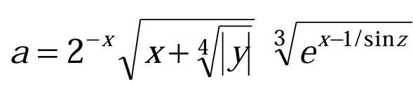

# Домашнее задание к работе 5

## Условие задачи
Вычислить значение величины `a` по формуле:
<p align="center">  </p>

## 1. Алгоритм

### Алгоритм
1. **Начало**
2. Установить локализацию для корректного отображения символов
3. Объявить переменные:
   - `x`, `y`, `z` - входные значения
   - `a` - результат вычислений
4. Ввести значения переменных от пользователя:
   - Ввести значение `x`
   - Ввести значение `y`
   - Ввести значение `z`
5. Вычислить значение величины `a` по формуле
6. Вывести введенные значения и результат вычислений
7. **Конец**

## 2. Реализация программы

```c
#include <stdio.h>
#include <locale.h>
#include <math.h>

int main() {
    setlocale(LC_ALL, "");

    double x, y, z, a;

    printf("ПРОГРАММА ВЫЧИСЛЕНИЯ ВЕЛИЧИНЫ a\n");
    printf("===============================\n\n");

    // Ввод значений от пользователя
    printf("Введите значение x: ");
    scanf_s("%lf", &x);

    printf("Введите значение y: ");
    scanf_s("%lf", &y);

    printf("Введите значение z: ");
    scanf_s("%lf", &z);

    printf("\nВВЕДЕННЫЕ ЗНАЧЕНИЯ:\n");
    printf("===================\n");
    printf("x = %.6f\n", x);
    printf("y = %.1f\n", y);
    printf("z = %.3f\n", z);

    // Вычисление значения
    a = pow(2, -x) * sqrt(x + pow(fabs(y), 1.0 / 4.0)) * pow((exp(x - 1 / sin(z))), 1.0 / 3.0);

    printf("\nРЕЗУЛЬТАТ ВЫЧИСЛЕНИЙ:\n");
    printf("=====================\n");
    printf("a = %.5f\n", a);

    return 0;
}
```

## 3. Результаты работы программы

При значениях из контрольного примера:
```
ПРОГРАММА ВЫЧИСЛЕНИЯ ВЕЛИЧИНЫ a
===============================

Введите значение x: 0,039810
Введите значение y: -1625
Введите значение z: 0,512

ВВЕДЕННЫЕ ЗНАЧЕНИЯ:
===================
x = 0,039810
y = -1625,0
z = 0,512

РЕЗУЛЬТАТ ВЫЧИСЛЕНИЙ:
=====================
a = 1,26185
```

## 4. Информация о разработчике

Маркина Елена, группа бТИИ-251
